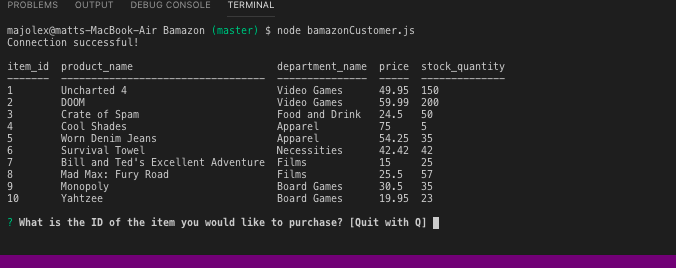
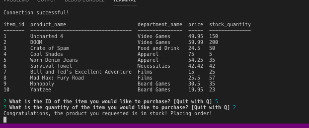

# Bamazon
## The goal was to create an Amazon-like store front using Node.js and MySQL.

## Getting Started

- Clone repo.
- Run command in Terminal or Gitbash 'npm install'
- Run command depending which mode you would like to be on:
    * Customer - 'npm run customer'
   

### What Each JavaScript Does

1. `BamazonCustomer.js`

    * Prints the products in the store.

    * Prompts customer which product they would like to purchase by ID number.

    * Asks for the quantity.

      * If there is a sufficient amount of the product in stock, it will return the total for that purchase.
      * However, if there is not enough of the product in stock, it will tell the user that there isn't enough of the product.
      * If the purchase goes through, it updates the stock quantity to reflect the purchase.
      * It will also update the product sales in the department table.

      ## Screen Shots

